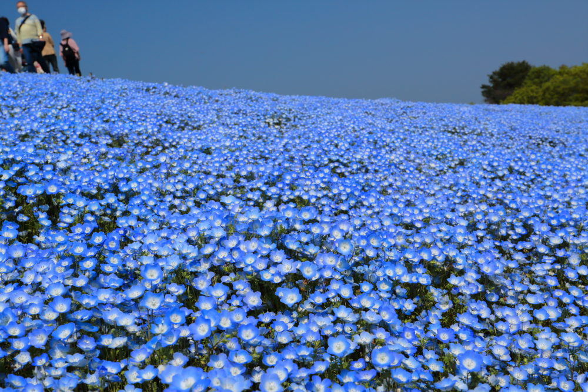
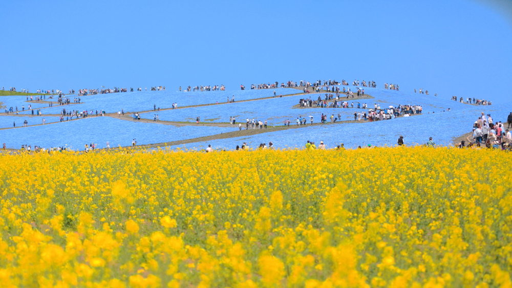
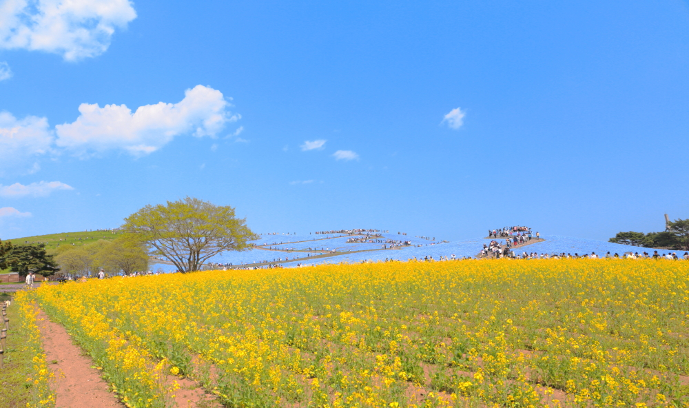

# hitachi_nemophila
<html lang="ja">
 <head>
  <meta charset="utf-8" />
 

   <link href="https://cdnjs.cloudflare.com/ajax/libs/lightbox2/2.7.1/css/lightbox.css" rel="stylesheet">

</head>
<body>
<h1><marquee behavior="left">!!! ひたち海浜公園ネモフィラ、2018/04/20(金) !!!</marquee></h1>

2018年4月20日,昼12:50頃＠ひたち海浜公園

                          

<marquee direction="right" scrollamount="20" width="30%">(^_^)/~torokoid</marquee>

<h3>↓ 画像はクリックで拡大します。</h3>	

	
	
	

	
	
	

	
	
	

	
	
	

	

  
<h4>↓ひたち海浜公園HPへのリンク</h4>
<a href="http://www.town.mashiko.tochigi.jp/page/dir000394.html" target="_blank">ひたち海浜公園</a>
     
</body>
	</html>
	
<!-- フッタ -->
 <footer>
 Copyright 2018/08/17 Torokoid-Mibu
 </footer>
